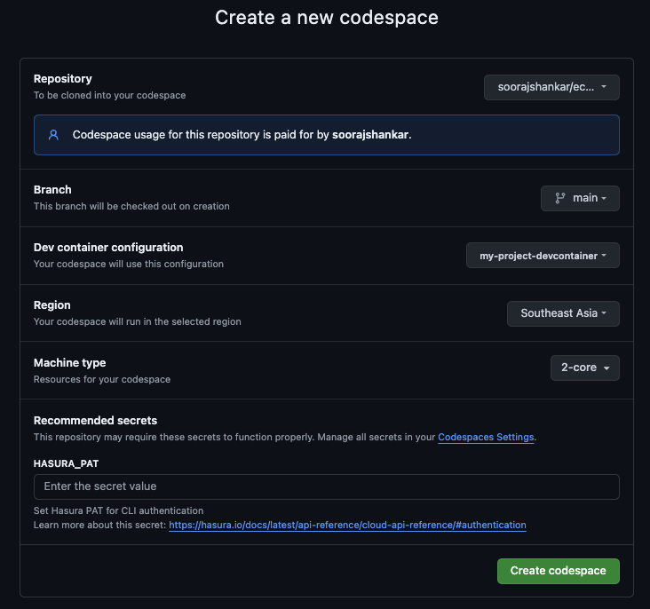
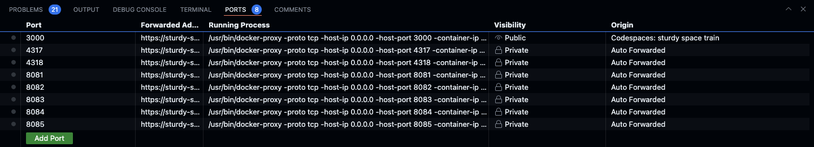
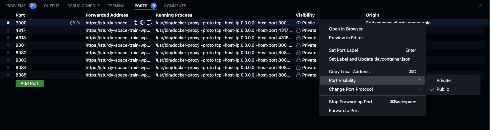

## Quickstart with Github Codespace

[](https://codespaces.new/soorajshankar/ecommerce_codespace_test)

1. Provide the Hasura PAT on this screen as a secret
   

2. Start the engine and connector services

```shell
HASURA_DDN_PAT=$(ddn auth print-pat) docker compose -f docker-compose.hasura.yaml watch
```

This will run several docker services and can be checked at the bottom of the screen as shown below



> Update the port visibility 

2. start the TS function runtime

Open a new terminal (the previous script needs to be running to continou further) and execute the following

```shell
cd sales/connector/ts && npm i
npx dotenv -e .env.local -- npm run watch
```

- Update the port 3000 to have public port visibility to `PUBLIC` as shown below to leverage the Hasura console, without this you can still use the plain GraphiQL UI running on 3000 where you can execute queries but not use any of the Hasura console features.



- Open console with this URL https://console.hasura.io/local/graphql?url=https://<your-github-app-url>.app.github.dev/ and test using GraphQL API queries from the [Composability folder](https://github.com/hasura/ddn_beta_ecommerce/tree/main/Composability).


  - For [AuthZ](https://github.com/hasura/ddn_beta_ecommerce/blob/main/Composability/authZ.graphQL): Set x-hasura-role = customer and x-hasura-user-id = some_user_id and run the AuthZ query

This example supergraph is composed of four subgraphs - users, analytics, experience, and sales, each backed by one or more data connectors. These subgraphs integrate various data sources to provide a comprehensive Ecommerce solution as follows.


### Making changes 

After making changes, you can rebuild the engine build by executing the following command without restarting/rebuilding the docker services. Docker watch mode will restart the engine with the new configuration.

```shell
ddn supergraph build local --output-dir ./engine
```